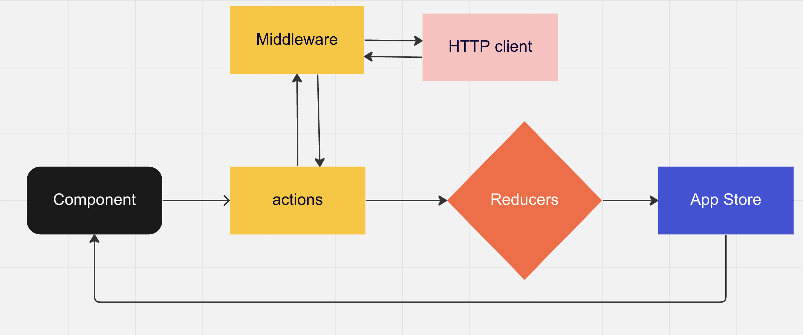

# Playground react app.

### Sample redux architecture for data fetching using random words API from [vercel](http://random-words-api.vercel.app/word).



### Getting started

```
cd exampleapp
npm install or yarn
npm start
```

### Folder Structure

```sh
exampleapp/
├── public
├── src
    ├── actions
    ├── components
    ├── middlewares
    ├── normalizers       # for transforming data
    ├── reducers
    ├── services         # axios setup
    └── store
```
